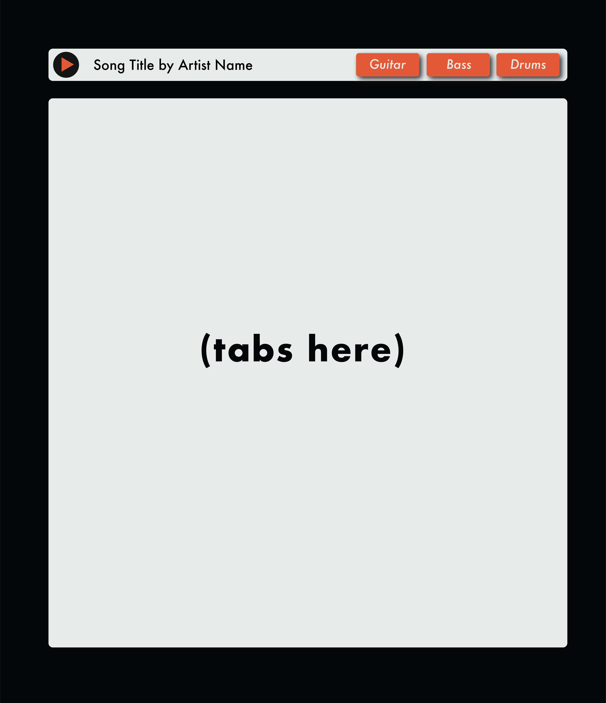

# PLAYlist

## 💬Description
A website for users to create and discover playlists from various streaming platforms through Openwhyd API while also being able to look up corresponding tabs/chords for guitar, bass, and drums through Songsterr API.

## 📓Table of Contents
* [Purpose](#purpose)
* [Mock Up](#mock-up)
* [Built With](#built_with)
* [Installation](#installation)
* [Website](#website)
* [Contributing](#contributing)
* [Questions](#questions)

## ⚡Purpose 
* AS A musician
* I WANT to find songs that I want to learn
* SO THAT I can teach myself how to play them in an efficient manner
  
  
* GIVEN ...
* WHEN I ...
* THEN I ...

## 🎨Mock-Up

  

## :pencil2:Built With
* HTML
* CSS
* Javascript
* Tailwind
* JQuery
* Google Fonts
* Font Awesome

## 🔌Installation
The user should clone the repository from GitHub and open up the project in the browser from the index file.

## 💻Website
Please view deployed application at [PLAYlist](https://tpgent01.github.io/weather-dashboard/).

  

## 📌Contributing
Contributors should read the installation section.

## ❓Questions
If you have any questions about this projects, please contact us directly at _______.com. 
